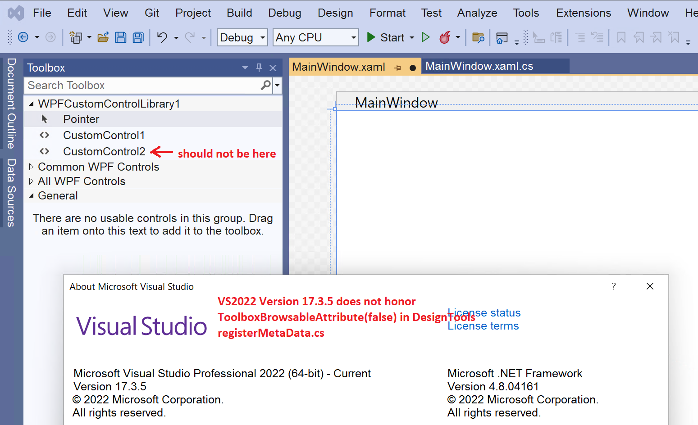

# NETFrameworkWPFControl_VS2022v17.3_ToolboxBug
The BUG: VS2022 v17.3.x includes ALL controls for a custom .NET Framework WPF library in the VS toolbox rather than controls filtered by the DesignTools assembly using ToolboxBrowsableAttribute code. This appeared to work correctly in VS2022 v17.2.7 and earlier.

**The VS 2022 17.3.x toolbox bug is reproduced by a simple WpfCustomControlLibrary in this repo. The WPFCustomLibrary.sln contains:**
- WpfCustomControlLibrary - A .NET Framework 4.6.2 project with two custom controls: CustomControl1 (which we want in the VS toolbox) and CustomControl2 (we do not want in the VS toolbox)
- WpfCustomControlLibrary.DesignTools for VS2022 - A .NET Framework 4.7.2. project that specifies which controls initialize into the VS2022 toolbox (*this part is not working*), and contains a DefaultInitializer for each control that sets Background color and size (*this part is working in VS2022 on the WPF design surface*).
- WpfCustomControlLibrary.Design for VS2019 - A .NET Framework 4.6.2. project that specifies which controls initialize into the VS2019 toolbox. Our product supports both VS2019 and VS2022, so I'm including this Design assembly.
- WPFCustomControls_VS2019VS2022 - Builds an msi installer that includes WpfCustomControlLibrary, WpfCustomControlLibrary.DesignTools for VS2022, and WpfCustomControlLibrary.Design for VS2019.
- WPFCustomControls_VS2022 - Builds an msi installer that includes  WpfCustomControlLibrary and only WpfCustomControlLibrary.DesignTools for VS2022. *This is only for targeted testing of VS2022 and DesignTools*

**Note: The above installer projects use the Microsoft Visual Studio Installer Projects 2022 extension. For convenience I created installers (setup.exe and WpfCustomControlLibrary.msi) and put them in WPFCustomControls_VS2019VS2022 and WPFCustomControls_VS2022 subfolders in the "Installers" folder. Both installers install to "Program Files (x86)" and make WOW6432Node registry entries.**

The RegisterMetaData class implements Microsoft.VisualStudio.DesignTools.Extensibility.Metadata.IProvideAttributeTable. The bug is VS2022 v17.3.x does not use this code to filter which .NET Framework WPF controls initialize into the VS 2022 toolbox.
```
// Specify which controls initialize into the VS2022 toolbox
builder.AddCustomAttributes("WpfCustomControlLibrary.CustomControl1", new ToolboxBrowsableAttribute(true));
builder.AddCustomAttributes("WpfCustomControlLibrary.CustomControl2", new ToolboxBrowsableAttribute(false));
```

**To reproduce the bug:**
1. Copy setup.exe and WpfCustomControlLibrary.msi from one of the installer subfolders to a machine with VS2022 v17.3.x
2. Run setup.exe
3. In VS2022 create a WPF App .NET Framework project (for .NET Framework 4.6.2 or 4.7.2)
4. Show MainWindow.xaml
5. Open the VS toolbox. The toolbox should initialize with controls from WpfCustomControlLibrary.
6. FAIL: Only CustomControl1 should be in the toolbox, but it also contains CustomControl2



_Update: VS2022 v17.2.7 was pulling this ToolboxBrowsableAttribute information from a Design.dll assembly in our control library intended for VS2019; Microsoft corrected this but still has not added ToolboxBrowsableAttribute support in the DesignTools.dll assembly for VS2022._


